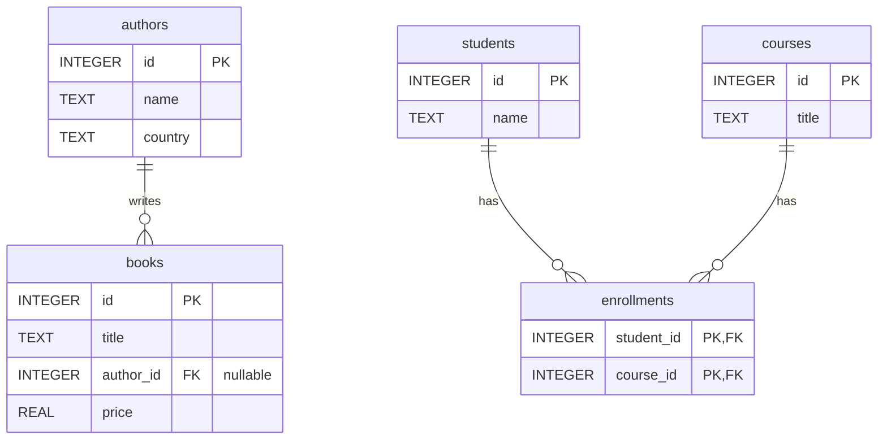

## Database Schema

```mermaid
erDiagram
    authors ||--o{ books : writes
    students ||--o{ enrollments : has
    courses ||--o{ enrollments : has

    authors {
        INTEGER id PK
        TEXT name
        TEXT country
    }
    books {
        INTEGER id PK
        TEXT title
        INTEGER author_id FK "nullable"
        REAL price
    }
    students {
        INTEGER id PK
        TEXT name
    }
    courses {
        INTEGER id PK
        TEXT title
    }
    enrollments {
        INTEGER student_id PK, FK
        INTEGER course_id PK, FK
    }
```
